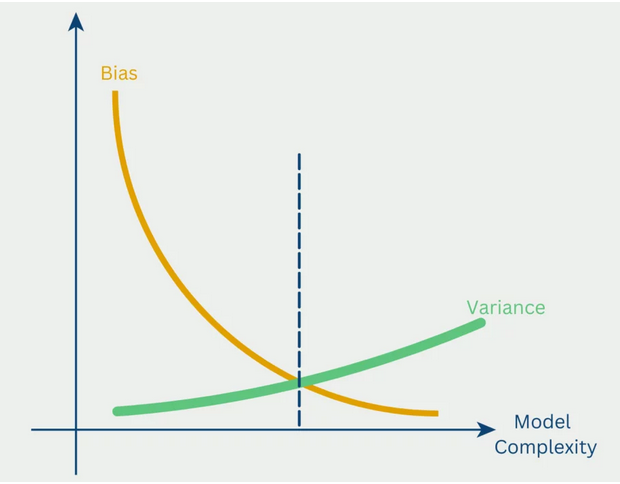

# Bias-Variance Tradeoff

## Overview

The bias-variance tradeoff is a fundamental concept in machine learning that describes the relationship between a model's complexity and its ability to generalize. Understanding this tradeoff is crucial for building models that perform well on unseen data.

## Components of Error

Total prediction error can be decomposed into three parts:

```
Total Error = Bias² + Variance + Irreducible Error
```

### 1. Bias
- **Definition**: Error from overly simplistic assumptions
- **High Bias**: Model is too simple, can't capture underlying patterns
- **Example**: Linear model trying to fit non-linear data
- **Result**: Underfitting

### 2. Variance
- **Definition**: Error from sensitivity to small fluctuations in training set
- **High Variance**: Model is too complex, learns noise instead of signal
- **Example**: Deep decision tree memorizing training data
- **Result**: Overfitting

### 3. Irreducible Error
- **Definition**: Inherent noise in the data
- **Cannot be reduced**: No model can eliminate this
- **Example**: Measurement errors, random variations

## The Tradeoff

As model complexity increases:
- **Bias decreases**: Model can capture more complex patterns
- **Variance increases**: Model becomes more sensitive to training data
- **Goal**: Find the sweet spot that minimizes total error

## Visual Representation



## Model Complexity Examples

### Low Complexity (High Bias, Low Variance)
- **Linear Regression**: Simple, stable, but may miss patterns
- **Naive Bayes**: Strong assumptions, but consistent
- **Symptoms**: Poor performance on both train and test

### Medium Complexity (Balanced)
- **Random Forest**: Good balance, generalizes well
- **SVM with moderate C**: Balanced complexity
- **Symptoms**: Good performance on both train and test

### High Complexity (Low Bias, High Variance)
- **Deep Neural Networks**: Very flexible, but can overfit
- **Unpruned Decision Trees**: Can memorize training data
- **Symptoms**: Great on train, poor on test

## Diagnosing Bias vs Variance

### High Bias (Underfitting)
**Symptoms:**
- High training error
- High validation error
- Training and validation errors are similar
- Model is too simple

**Solutions:**
- Increase model complexity
- Add more features
- Reduce regularization
- Use more complex algorithms

### High Variance (Overfitting)
**Symptoms:**
- Low training error
- High validation error
- Large gap between train and validation error
- Model is too complex

**Solutions:**
- Reduce model complexity
- Add more training data
- Increase regularization
- Use simpler algorithms
- Feature selection
- Early stopping

## Balancing the Tradeoff

### Strategies

1. **Regularization**
   - L1/L2 regularization reduce variance
   - Increase bias slightly to reduce variance significantly

2. **Ensemble Methods**
   - Bagging reduces variance
   - Boosting reduces bias

3. **Cross-Validation**
   - Helps identify optimal complexity
   - Prevents overfitting to validation set

## Practical Guidelines

### For High Bias:
```
If train_error ≈ val_error and both are high:
    → Increase complexity
    → Add features
    → Use more powerful model
```

### For High Variance:
```
If train_error << val_error:
    → Reduce complexity
    → Add regularization
    → Use simpler model
```

## Key Takeaways

1. **Goal**: Minimize total error (bias² + variance)
2. **Complexity matters**: Too simple = high bias, too complex = high variance
4. **Regularization balances**: Increases bias to reduce variance

## Image Credits

- **Bias-Variance Tradeoff Diagram**: https://www.google.com/url?sa=t&source=web&rct=j&url=https%3A%2F%2Fmedium.com%2F%40dhiraj_pant%2Funderstanding-the-bias-variance-tradeoff-in-machine-learning-0ae0c99ea07d&ved=0CBYQjRxqFwoTCOji-fTjnJIDFQAAAAAdAAAAABA-&opi=89978449
